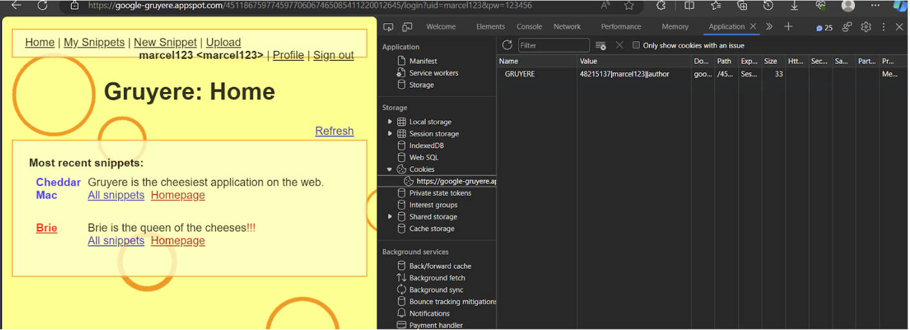
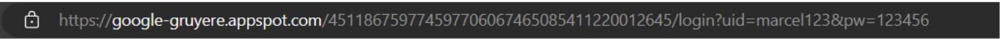
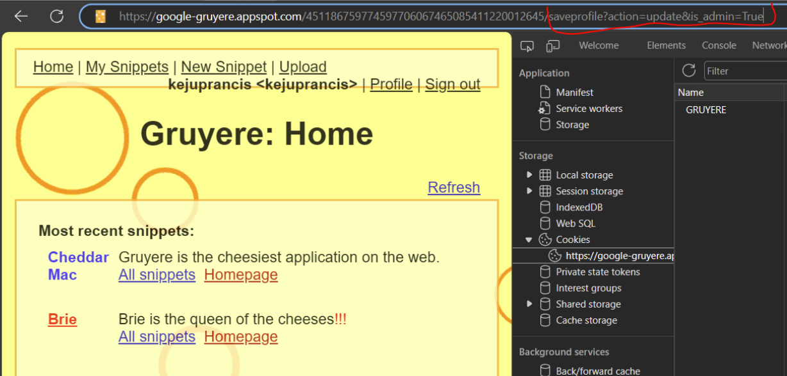
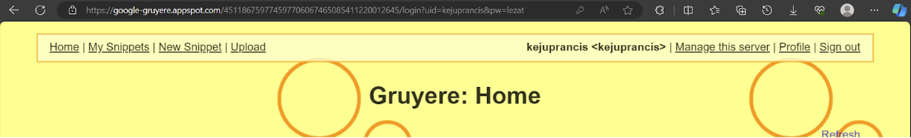
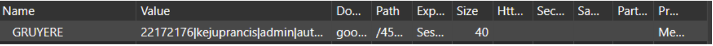

# Study-Case-Keamanan-Jaringan
## Case Study 04 Keamanan Jaringan

### Tantangan : 
Selesaikan tantangan link/aplikasi berikut : 
https://google-gruyere.appspot.com/464210600826703475599559119201074283175/

### Ketentuan :
<li>Analisis dan gunakan teknik yang sudah anda pelajari (serta tools apa yang digunakan)</li>
<li>Kerjakan secara berkelompok (3 orang)</li>
<li>Hasil analisis dilaporkan dalam sebuah laporan *.docx</li>
<li>Proses percobaan dan pembobolan direkam dalam sebuah video</li>
<li>Kumpulkan pada drive, buat folder berdasarkan kelompok</li>

### Tools :
Inspect element browser (NETWORK, APPLICATION = COOKIES), web browser.

### Langkah 1
### Screenshot 

### Penjelasan
Melakukan login pada website tersebut, pada gambar terlihat bahwa terdapat value yang dimana berisikan nomor hash, username dan juga tingkat authority nya.

### Langkah 2
### Screenshot

### Penjelasan
Disitu juga terdapat kelemahan dimana saat user melakukan login, cookies tersebut nampak pada url. Dari situ kita telah menemukan celah dari website ini.

### Langkah 3
### Screenshot

### Penjelasan
Percobaan request menggunakan tambahan url setelah hash numbernya 
```/saveprofile?action=update&is_admin=True.```

### Langkah 4
### Screenshot

### Penjelasan
Perubahan dari user kejuprancis dimana yang sebelumnya menjadi author ke admin, terbukti bahwa user ini bisa mengatur server dari website ini.

### Langkah 5
### Screenshot

### Penjelasan
Disitu bukti bahwa cookies yang kita dapat dari webnya, kejuprancis memiliki 2 authority yaitu sebagai admin dan juga sebagai author

### Kesimpulan : 
Untuk meningkatkan keamanan aplikasi web secara menyeluruh, terapkan praktik-praktik keamanan, seperti validasi di sisi server, penggunaan token anti-CSRF, enkripsi HTTPS, otentikasi, otorisasi, pemeliharaan sistem, logging, pemantauan, pembaruan kebijakan keamanan reguler, pelatihan pengguna, dan pentesting, sambil juga melibatkan langkah-langkah khusus pada pengaturan cookies, termasuk pengaturan opsi Secure, HttpOnly, dan SameSite, enkripsi data dalam cookie, pencegahan serangan XSS, pembaruan reguler, dan pengujian penetrasi secara berkala.

### Referensi
Rohmatulloh, L. [@luckyrohmatulloh4617]. (2021, November 28). GOOGLR GRUYERE TUTORIAL HACKING MENJADI ADMIN - UTS PKSJ. Youtube. https://www.youtube.com/watch?v=4y6LTqL0o5Q 

EvilTester-Software Testing [@EvilTester]. (2021, November 28). An exploratory Technical Web Testing session using Gruyere and Google Chrome. Youtube. https://www.youtube.com/watch?v=bB5naSncI_Q&t=1003s 


